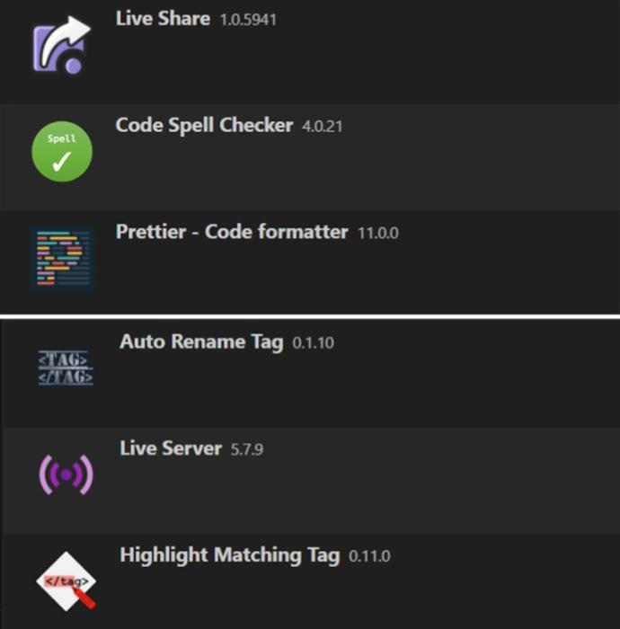

# VS CODE SETUP

## EXTENSIONS



#### _Prettier - Code Formatter_

An opinionated code formatter that enforces consistent code style for supported languages.

```json
{
  "editor.defaultFormatter": "esbenp.prettier-vscode",
  "editor.formatOnSave": true
}
```

#### _Live Server_

Launch a development local Server with live reload feature for static & dynamic pages

#### _Live Share_

Collaborate in real-time by sharing your workspace and terminal with others.

#### _Auto Rename Tag_

Auto rename paired HTML/XML tag

#### _Highlight Matching Tag_

Highlights matching tags in your HTML or XML files, improving readability and navigation.

```json
"highlight-matching-tag.styles": {
  "opening": {
    "left": {
      "custom": {
        "borderWidth": "0 0 0 2px",
        "borderStyle": "solid",
        "borderColor": "red",
        "borderRadius": "10px"
      }
    },
    "right": {
      "custom": {
        "borderWidth": "0 2px 0 0",
        "borderStyle": "solid",
        "borderColor": "red",
        "borderRadius": "10px"
      }
    }
  }
}
```

#### _Code Spell Checker_

Helps identify and fix spelling errors in your code and comments.

# Setting Up Prettier Code Formatter in VS Code

If you've installed Prettier but haven't configured it as your default code formatter in Visual Studio Code, follow these detailed steps:

## 1. **Install Prettier Extension**

Ensure the Prettier extension is installed in VS Code.

1. Open Visual Studio Code.
2. Go to the Extensions view by clicking the Extensions icon in the Activity Bar on the side (`Ctrl+Shift+X` or `Cmd+Shift+X` on macOS).
3. Search for **Prettier - Code formatter**.
4. Click **Install** if it isn't already installed.

&nbsp;

## 2. **Set Prettier as the Default Formatter**

To make Prettier your default formatter:

1. Open the Command Palette (`Ctrl+Shift+P` or `Cmd+Shift+P` on macOS).
2. Search for `Preferences: Open Settings (JSON)` and select it.
3. Add or update the following settings in the `settings.json` file:

   ```json
   {
     "editor.defaultFormatter": "esbenp.prettier-vscode",
     "editor.formatOnSave": true
   }
   ```

   - `editor.defaultFormatter`: Ensures Prettier is used for formatting.
   - `editor.formatOnSave`: Formats your file automatically when you save it.

&nbsp;

## 3. **Specify Prettier for Specific Languages (Optional)**

If you want Prettier to format specific file types (e.g., JavaScript, TypeScript, etc.), add the following settings:

```json
{
  "[javascript]": {
    "editor.defaultFormatter": "esbenp.prettier-vscode"
  },
  "[typescript]": {
    "editor.defaultFormatter": "esbenp.prettier-vscode"
  },
  "[json]": {
    "editor.defaultFormatter": "esbenp.prettier-vscode"
  }
}
```

&nbsp;

## 4. **Ensure Prettier is Working**

1. Open a code file (e.g., a `.js`, `.ts`, or `.json` file).
2. Right-click in the editor and select **Format Document**.
3. Prettier should format your code. If it doesn’t:
   - Check for conflicts with other installed formatters.
   - Disable or uninstall other formatters from the Extensions view.

&nbsp;

## 5. **Test Prettier**

1. Open a code file with unformatted content.
2. Save the file or manually run **Format Document**.
3. Verify that the file is formatted according to Prettier’s rules.

&nbsp;

## Additional Tips

- **Keyboard Shortcut for Formatting**: Assign a shortcut for `Format Document` for quick formatting.
- **Disable Format on Save (if needed)**: You can turn off `editor.formatOnSave` if you only want to format manually.

Now you’re ready to use Prettier to keep your code clean and consistent!
